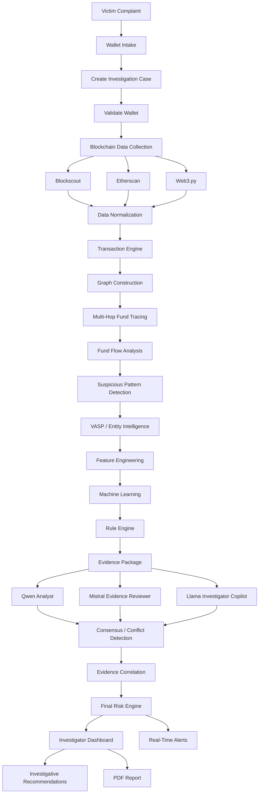
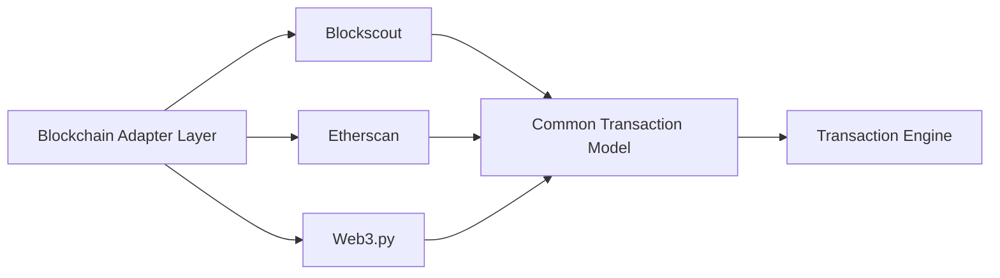
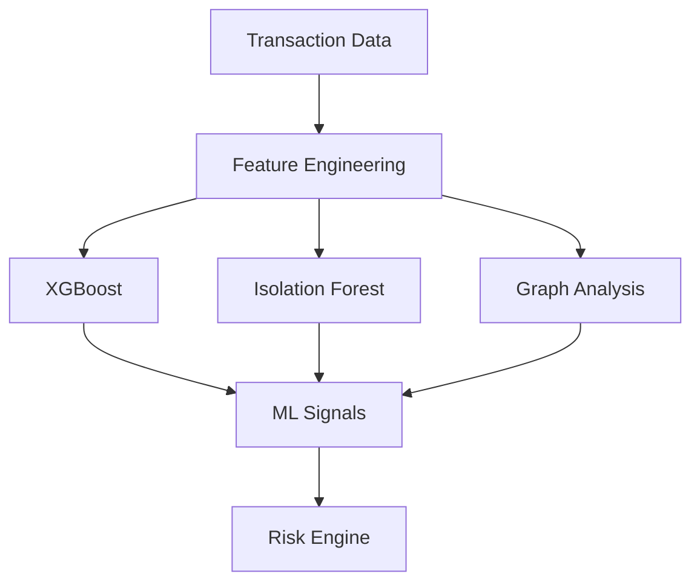
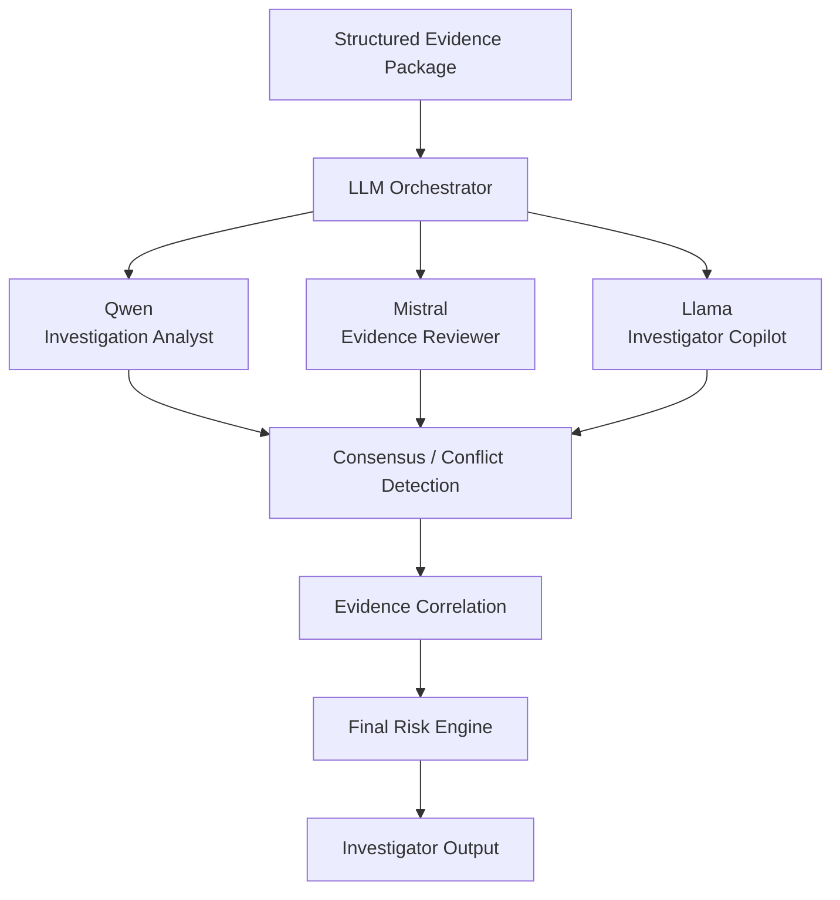
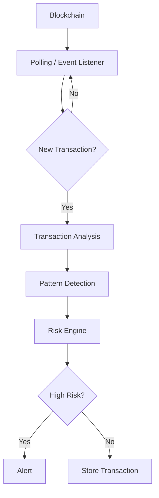
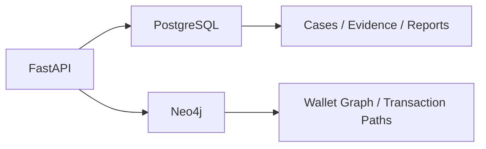
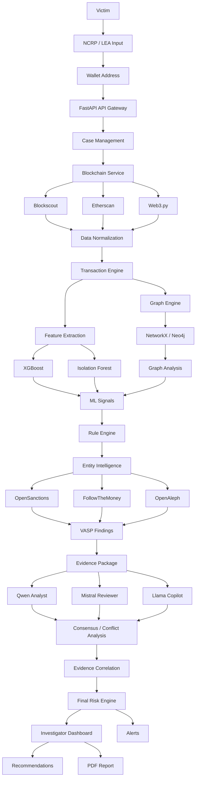

````markdown
# Real-Time Crypto Fraud Attribution & Investigation Platform

> An investigator-focused blockchain intelligence platform for tracing cryptocurrency fraud, identifying intermediary wallets and VASP associations, detecting suspicious transaction patterns, combining rule-based and ML risk signals, and generating evidence-grounded investigation reports using multiple specialized LLMs.

---

## Table of Contents

- [1. Overview](#1-overview)
- [2. Problem Statement](#2-problem-statement)
- [3. Objectives](#3-objectives)
- [4. Key Features](#4-key-features)
- [5. High-Level Architecture](#5-high-level-architecture)
- [6. End-to-End Investigation Workflow](#6-end-to-end-investigation-workflow)
- [7. Wallet Intake](#7-wallet-intake)
- [8. Blockchain Data Collection](#8-blockchain-data-collection)
- [9. Multi-Provider Blockchain Architecture](#9-multi-provider-blockchain-architecture)
- [10. Data Normalization](#10-data-normalization)
- [11. Transaction Graph](#11-transaction-graph)
- [12. Multi-Hop Fund Tracing](#12-multi-hop-fund-tracing)
- [13. Fund Flow Analysis](#13-fund-flow-analysis)
- [14. Suspicious Pattern Detection](#14-suspicious-pattern-detection)
- [15. VASP Identification](#15-vasp-identification)
- [16. Exchange Wallet Clustering](#16-exchange-wallet-clustering)
- [17. Machine Learning Layer](#17-machine-learning-layer)
- [18. Rule Engine](#18-rule-engine)
- [19. Mandatory Multi-LLM Architecture](#19-mandatory-multi-llm-architecture)
- [20. Specialized LLM Roles](#20-specialized-llm-roles)
- [21. Multi-LLM Consensus](#21-multi-llm-consensus)
- [22. LLM Guardrails](#22-llm-guardrails)
- [23. Evidence Correlation](#23-evidence-correlation)
- [24. Final Risk Engine](#24-final-risk-engine)
- [25. Investigative Recommendations](#25-investigative-recommendations)
- [26. Case Management](#26-case-management)
- [27. Investigator Dashboard](#27-investigator-dashboard)
- [28. Real-Time Monitoring](#28-real-time-monitoring)
- [29. Cross-Chain Architecture](#29-cross-chain-architecture)
- [30. Bridge Detection](#30-bridge-detection)
- [31. API Architecture](#31-api-architecture)
- [32. Database Architecture](#32-database-architecture)
- [33. Evidence Data Model](#33-evidence-data-model)
- [34. LLM Context Pipeline](#34-llm-context-pipeline)
- [35. LLM Output Schema](#35-llm-output-schema)
- [36. Report Generation](#36-report-generation)
- [37. Complete Data Flow](#37-complete-data-flow)
- [38. Security and Reliability](#38-security-and-reliability)
- [39. Repository Structure](#39-repository-structure)
- [40. Two-Day SIH MVP](#40-two-day-sih-mvp)
- [41. MVP vs Scalable Architecture](#41-mvp-vs-scalable-architecture)
- [42. Why Multiple LLMs](#42-why-multiple-llms)
- [43. What Makes the Platform Different](#43-what-makes-the-platform-different)
- [44. Analytical Principles](#44-analytical-principles)
- [45. Technology Stack](#45-technology-stack)
- [46. Expected Outcome](#46-expected-outcome)
- [47. Future Enhancements](#47-future-enhancements)

---

# 1. Overview

The **Real-Time Crypto Fraud Attribution & Investigation Platform** is an investigator-focused intelligence system designed to trace cryptocurrency funds from a victim-reported wallet, reconstruct the movement of funds across multiple transaction hops, identify intermediary wallets and exchange/VASP associations, detect suspicious transaction patterns, calculate explainable risk scores, and generate standardized investigation reports.

The platform is designed around one central investigative question:

> **A victim reported this wallet. Where did the money go, which intermediary wallets were involved, did it reach a VASP, what suspicious patterns occurred, what evidence supports the findings, and what should the investigator examine next?**

The system is intentionally more than a blockchain explorer.

A conventional blockchain explorer primarily answers:

```text
"What transactions happened?"
````

This platform attempts to answer:

```text
"Where did the victim's funds move?
 Which wallets were involved?
 What patterns occurred?
 Did funds reach a known or inferred VASP?
 What evidence supports the findings?
 How strong are the analytical signals?
 What should the investigator examine next?"
```

The platform combines:

* Blockchain intelligence
* Multi-hop fund tracing
* Transaction graph analytics
* VASP/entity intelligence
* Exchange wallet clustering
* Rule-based detection
* Machine learning
* Graph analytics
* Mandatory multi-LLM intelligence
* Evidence correlation
* Explainable risk scoring
* Real-time monitoring
* Investigator dashboards
* Automated report generation

---

# 2. Problem Statement

Cryptocurrency fraud investigations can become difficult when stolen funds:

* Move through multiple wallets.
* Split into several addresses.
* Are consolidated later.
* Move rapidly between wallets.
* Interact with exchange/VASP addresses.
* Pass through bridge contracts.
* Cross blockchain boundaries.
* Use complex transaction patterns.

A manual investigation may require investigators to:

| Investigation Task               | Manual Difficulty |
| -------------------------------- | ----------------- |
| Collect blockchain data          | High              |
| Follow multiple transaction hops | High              |
| Identify intermediary wallets    | High              |
| Detect suspicious patterns       | High              |
| Identify VASP relationships      | High              |
| Correlate evidence               | Very High         |
| Calculate risk                   | High              |
| Preserve evidence                | High              |
| Prepare reports                  | Very High         |

The proposed platform automates and assists this workflow while keeping the final investigative decision with the human investigator.

---

# 3. Objectives

The platform aims to:

1. Accept a victim-reported cryptocurrency wallet.
2. Validate the wallet and create an investigation case.
3. Retrieve blockchain transactions using multiple providers.
4. Normalize heterogeneous blockchain data.
5. Construct a transaction graph.
6. Perform configurable multi-hop fund tracing.
7. Analyze inflows, outflows and counterparties.
8. Detect suspicious transaction patterns.
9. Detect bridge and cross-chain interactions where supported.
10. Identify known or likely exchange/VASP associations.
11. Cluster related exchange wallets where evidence supports the relationship.
12. Extract behavioral features for ML analysis.
13. Generate multiple independent ML signals.
14. Apply deterministic explainable rules.
15. Run multiple specialized LLMs as a mandatory intelligence layer.
16. Cross-check LLM conclusions against structured evidence.
17. Generate an explainable final risk assessment.
18. Generate evidence-backed investigative recommendations.
19. Monitor new transactions.
20. Generate standardized investigation reports.

---

# 4. Key Features

| Feature              | Description                                                  |
| -------------------- | ------------------------------------------------------------ |
| Wallet Intake        | Create investigations from reported wallet addresses         |
| Multi-Provider Data  | Retrieve data from multiple blockchain sources               |
| Data Normalization   | Convert provider-specific responses into a common schema     |
| Multi-Hop Tracing    | Follow funds across configurable transaction hops            |
| Graph Analytics      | Represent wallets and transactions as a directed graph       |
| Fund Flow Analysis   | Analyze inflows, outflows, counterparties and timing         |
| Pattern Detection    | Detect rapid movement, layering, splitting and consolidation |
| VASP Intelligence    | Identify known or inferred exchange/VASP relationships       |
| Wallet Clustering    | Group addresses associated with an entity                    |
| ML Analysis          | Generate supervised and anomaly-based risk signals           |
| Rule Engine          | Produce deterministic and explainable risk factors           |
| Multi-LLM            | Qwen + Mistral + Llama as mandatory specialized models       |
| Evidence Review      | Validate claims against structured evidence                  |
| Risk Engine          | Combine rule, ML and graph signals                           |
| Real-Time Monitoring | Detect new transactions and trigger alerts                   |
| Cross-Chain Ready    | Support normalized multi-chain transaction data              |
| Report Generation    | Generate evidence-backed PDF reports                         |
| Case Management      | Maintain investigations, evidence and analysis history       |

---

# 5. High-Level Architecture

```text
                         VICTIM / COMPLAINT
                                |
                                v
                       INVESTIGATOR INPUT
                                |
                                v
                     +----------------------+
                     |      API GATEWAY     |
                     |       FastAPI        |
                     +----------+-----------+
                                |
                                v
                    +-----------------------+
                    |   CASE MANAGEMENT      |
                    | PostgreSQL + Pydantic  |
                    +-----------+------------+
                                |
                                v
                    +-----------------------+
                    | BLOCKCHAIN DATA LAYER |
                    +-----------+------------+
                                |
          +---------------------+----------------------+
          |                     |                      |
          v                     v                      v
     Blockscout             Etherscan               Web3.py
          |                     |                      |
          +---------------------+----------------------+
                                |
                                v
                    +-----------------------+
                    | DATA NORMALIZATION     |
                    | Pandas + NumPy         |
                    +-----------+------------+
                                |
                 +--------------+--------------+
                 |                             |
                 v                             v
        TRANSACTION ENGINE               GRAPH ENGINE
                                          NetworkX + Neo4j
                 |                             |
                 v                             v
          FEATURE ENGINEERING          GRAPH FEATURES / PATHS
                 |
        +--------+--------+
        |                 |
        v                 v
     XGBoost        Isolation Forest
        |                 |
        +--------+--------+
                 |
                 v
          +-------------------+
          |    RULE ENGINE    |
          +---------+---------+
                    |
                    v
          +-------------------+
          | ENTITY / VASP INTEL|
          +---------+---------+
                    |
                    v
          +-------------------+
          | EVIDENCE PACKAGE  |
          +---------+---------+
                    |
                    v
          +-------------------+
          |  MULTI-LLM LAYER  |
          +---------+---------+
                    |
       +------------+------------+
       |            |            |
       v            v            v
     Qwen        Mistral       Llama
    Analyst      Reviewer      Copilot
       |            |            |
       +------------+------------+
                    |
                    v
          CONSENSUS / CONFLICT
               DETECTION
                    |
                    v
          EVIDENCE CORRELATION
                    |
                    v
             FINAL RISK ENGINE
                    |
          +---------+---------+
          |                   |
          v                   v
   INVESTIGATOR UI         ALERTS
 React + Cytoscape.js
 Recharts + Tailwind
          |
          v
      REPORT ENGINE
          |
          v
        PDF
```

---

# 6. End-to-End Investigation Workflow



---

# 7. Wallet Intake

The investigator submits information such as:

```text
Wallet Address:
0x7A23....91F2

Blockchain:
Ethereum

Case ID:
CYBER-2026-00142

Amount:
₹4,50,000

Complaint Type:
Investment Fraud
```

The system validates:

* Wallet address format
* Supported blockchain
* Required case information
* Duplicate case status
* Previous investigation status

### Example API

```http
POST /api/cases
```

### Request

```json
{
  "wallet_address": "0xABC...",
  "blockchain": "ethereum",
  "case_id": "CYBER-001",
  "fraud_type": "investment_fraud"
}
```

---

# 8. Blockchain Data Collection

After creating a case, the blockchain service retrieves transaction information.

```text
                    Wallet
                       |
                       v
              Blockchain Service
                       |
        +--------------+--------------+
        |              |              |
        v              v              v
   Blockscout      Etherscan       Web3.py
        |              |              |
        +--------------+--------------+
                       |
                       v
                Transaction Data
```

The platform can collect:

| Field            | Purpose                           |
| ---------------- | --------------------------------- |
| Transaction Hash | Unique transaction identifier     |
| Sender           | Source address                    |
| Receiver         | Destination address               |
| Native Amount    | Native cryptocurrency value       |
| Token Amount     | Token transfer value              |
| Token Symbol     | Token identification              |
| Contract Address | Token/contract identification     |
| Timestamp        | Transaction timing                |
| Block Number     | Blockchain evidence               |
| Status           | Success/failure                   |
| Gas Information  | Transaction execution information |
| Chain ID         | Blockchain identification         |
| Logs/Events      | Token and contract activity       |
| Provider         | Source provenance                 |

Example:

```text
TX001
Victim -> Wallet A
₹50,000

TX002
Wallet A -> Wallet B
₹48,500

TX003
Wallet B -> Wallet C
₹47,900

TX004
Wallet C -> Exchange X
₹47,500
```

The original provider/source is retained to preserve data provenance.

---

# 9. Multi-Provider Blockchain Architecture

The platform should not depend on a single blockchain API.



### Benefits

| Benefit               | Explanation                                       |
| --------------------- | ------------------------------------------------- |
| Provider Redundancy   | Reduces dependence on a single provider           |
| Better Coverage       | Different providers can expose different data     |
| Resilience            | Provider failures can be handled more effectively |
| Multi-Chain Expansion | New adapters can be added                         |
| Consistency           | Downstream systems use one common schema          |

Additional providers can later be added through the adapter layer:

* Alchemy
* Infura
* QuickNode
* Moralis
* Covalent
* Bitquery
* Chainbase

---

# 10. Data Normalization

Different providers return blockchain data in different formats.

The normalization layer converts them into a common representation.

### Example

```json
{
  "tx_hash": "0x123...",
  "chain": "ethereum",
  "from": "0xAAA...",
  "to": "0xBBB...",
  "amount": 47500,
  "token": "ETH",
  "timestamp": "2026-08-29T01:24:32",
  "block": 123456,
  "status": "success",
  "source": "blockscout"
}
```

### Technologies

```text
Python
Pandas
NumPy
Pydantic
```

The normalized model becomes the foundation for:

```text
Graph Construction
       +
Feature Engineering
       +
ML Analysis
       +
LLM Context
       +
Evidence Records
```

---

# 11. Transaction Graph

The transaction graph is one of the most important components.

### Graph Representation

```text
Wallet = Node
Transaction = Directed Edge
```

Example:

```text
                  Victim
                     |
                   ₹50K
                     |
                     v
                 Wallet A
                     |
                  ₹48.5K
                     |
                     v
                 Wallet B
                 /     \
             ₹20K       ₹28K
               |           |
               v           v
           Wallet C     Wallet D
               \           /
                \         /
                  Exchange
```

### Node Types

| Node           | Description                             |
| -------------- | --------------------------------------- |
| Victim Wallet  | Wallet reported in complaint            |
| Suspect Wallet | Wallet under investigation              |
| Intermediary   | Wallet between source and destination   |
| VASP Wallet    | Known or inferred exchange/VASP address |
| Contract       | Smart contract interaction              |
| Bridge         | Cross-chain bridge address              |
| Entity         | Identified organization                 |

### Edge Types

| Edge            | Meaning                 |
| --------------- | ----------------------- |
| TRANSFER        | Cryptocurrency transfer |
| TOKEN_TRANSFER  | ERC-20/token movement   |
| INTERACTED_WITH | Contract interaction    |
| CROSSED_VIA     | Bridge interaction      |
| ASSOCIATED_WITH | Entity association      |

### Graph Technologies

```text
NetworkX
Neo4j
Cytoscape.js
```

NetworkX is useful for prototyping and algorithmic analysis, while Neo4j provides persistent graph storage and graph traversal at larger scale.

---

# 12. Multi-Hop Fund Tracing

The platform follows funds beyond the first destination.

```text
Victim
  |
  v
Wallet A
  |
  v
Wallet B
  |
  v
Wallet C
  |
  v
Wallet D
  |
  v
Exchange
```

Example hop sequence:

| Hop | Address / Entity |
| --: | ---------------- |
|   0 | Victim           |
|   1 | Wallet A         |
|   2 | Wallet B         |
|   3 | Wallet C         |
|   4 | Wallet D         |
|   5 | Exchange         |

For every path, the system can calculate:

* Hop count
* Path value
* Time between hops
* Intermediary count
* Percentage of original funds retained
* Destination type
* Risk factors
* VASP distance

The investigator can configure the maximum tracing depth.

---

# 13. Fund Flow Analysis

For every investigated wallet, the system calculates:

| Metric                            | Description                        |
| --------------------------------- | ---------------------------------- |
| Total Inflow                      | Total funds received               |
| Total Outflow                     | Total funds sent                   |
| Transaction Count                 | Number of transactions             |
| Unique Senders                    | Number of source addresses         |
| Unique Receivers                  | Number of destination addresses    |
| Counterparties                    | Unique interacting wallets         |
| Average Transaction               | Mean transaction value             |
| Maximum Transaction               | Largest observed transaction       |
| Transaction Frequency             | Movement frequency                 |
| Average Time Between Transactions | Temporal behavior                  |
| First Transaction                 | Earliest observed activity         |
| Last Transaction                  | Most recent activity               |
| Intermediary Count                | Wallets encountered during tracing |

Example:

```text
Inflow:                    ₹4,50,000
Outflow:                   ₹4,42,000
Transactions:              37
Unique Counterparties:     18
Average Interval:          4.2 minutes
Maximum Transaction:       ₹1,20,000
```

---

# 14. Suspicious Pattern Detection

The platform uses three complementary approaches:

```text
Deterministic Rules
        +
Machine Learning
        +
Multiple LLMs
```

The LLMs interpret analytical evidence; they do not replace deterministic calculations.

---

## 14.1 Rapid Fund Movement

```text
Wallet A
   |
 2 min
   v
Wallet B
   |
 3 min
   v
Wallet C
```

Flag:

```text
RAPID FUND MOVEMENT
```

---

## 14.2 Layering

```text
A
|
v
B
|
v
C
|
v
D
|
v
E
```

A long sequence of intermediary wallets can be flagged for investigation as a potential layering pattern.

---

## 14.3 Fund Splitting

```text
             Wallet A
            /    |    \
           v     v     v
          B      C      D
```

One source distributing funds to several destinations can be identified as a splitting pattern.

---

## 14.4 Fund Consolidation

```text
B ----\
C -----+----> Exchange
D -----/
E ----/
```

Multiple wallets converging on a destination can be relevant to the investigation.

---

## 14.5 Peel Chain

```text
A
|
v
B
|
v
C
|
v
D
```

The system can look for repeated forwarding behavior where funds continue through a sequence of wallets while portions may be retained or forwarded.

---

## 14.6 VASP Interaction

```text
Suspect Wallet
      |
      v
Intermediary
      |
      v
Known VASP Address
```

Important:

> Interaction with a VASP is an investigative signal. It must not automatically be interpreted as evidence that the VASP is involved in criminal activity.

---

# 15. VASP Identification

**VASP** stands for **Virtual Asset Service Provider**.

The platform attempts to determine whether a destination wallet is associated with an exchange or other VASP.

Potential intelligence sources include:

* Verified address/entity datasets
* OpenSanctions
* FollowTheMoney
* OpenAleph
* Curated exchange address intelligence
* Internal investigator-confirmed labels
* Transactional evidence
* Behavioral evidence

### Example

```text
0xEXCHANGE123
       |
       v
Entity Intelligence
       |
       v
Known Organization?
       |
       v
Exchange / VASP
```

Example output:

```text
VASP IDENTIFIED

Entity:
Example Exchange

Relationship:
Receiving Wallet

Distance:
3 hops

Attribution:
VERIFIED

Confidence:
HIGH
```

---

# 16. Exchange Wallet Clustering

An exchange may operate multiple addresses.

```text
                    Exchange X
                  /     |      \
                 /      |       \
               W1       W2       W3
               |        |        |
              TX       TX       TX
```

The system can maintain an entity cluster:

```text
Entity: Exchange X

Associated Addresses:
- W1
- W2
- W3
- W4
- W5
```

Example path:

```text
Suspect
   |
   v
Wallet A
   |
   v
Wallet B
   |
   v
W3
   |
   v
Exchange X
```

Output:

```text
Nearest Identified VASP: Exchange X
Distance: 3 hops
Attribution: Verified / Inferred
Confidence: High
```

---

# 17. Machine Learning Layer

The ML architecture uses multiple signals instead of depending on one classifier.



---

## 17.1 Feature Engineering

Example features:

```text
transaction_count
total_inflow
total_outflow
unique_senders
unique_receivers
unique_counterparties
average_transaction
maximum_transaction
transaction_frequency
average_time_between_transactions
number_of_hops
number_of_intermediaries
fund_splitting_score
fund_consolidation_score
rapid_transfer_score
vasp_interaction
cross_chain_interaction
bridge_interaction
```

Example:

```text
Wallet A

Transactions:              48
Inflow:                    ₹8.2L
Outflow:                   ₹8.0L
Counterparties:            31
Average Interval:          3.2 min
Hops:                      6
VASP Interaction:          YES
```

---

## 17.2 XGBoost

XGBoost can be used as a supervised classification model when labeled training data is available.

```text
Features
   |
   v
XGBoost
   |
   v
Suspicious Probability
```

Example:

```text
XGBoost Probability = 0.89
```

The output is an analytical signal and not a legal conclusion.

---

## 17.3 Isolation Forest

Isolation Forest can identify unusual transaction behavior.

```text
Wallet Behavior
      |
      v
Isolation Forest
      |
      v
Anomaly Score
```

Example:

```text
Anomaly Score = 0.91
```

---

## 17.4 Graph ML

Advanced graph models can be introduced as the platform scales.

```text
Transaction Graph
       |
       v
PyTorch Geometric
       |
       +--> GraphSAGE
       +--> GCN
       +--> GAT
       |
       v
Graph Risk Signal
```

Graph ML acts as an additional signal rather than replacing deterministic evidence.

---

# 18. Rule Engine

The rule engine produces transparent and deterministic risk factors.

Example configuration:

| Rule                       | Example Weight |
| -------------------------- | -------------: |
| Rapid Transfers            |            +15 |
| Multiple Intermediary Hops |            +15 |
| Fund Splitting             |            +10 |
| Fund Consolidation         |            +10 |
| Known Risky Entity         |            +20 |
| VASP Interaction           |            +15 |
| Abnormal Transaction Size  |            +10 |
| Cross-Chain Movement       |             +5 |

Maximum:

```text
100
```

These weights should be configurable and calibrated against validation data rather than treated as universal truth.

---

# 19. Mandatory Multi-LLM Architecture

## Multiple LLMs are a required part of the platform.

The platform does **not** treat multi-LLM intelligence as an optional enhancement.

The initial architecture uses:

```text
Qwen
Mistral
Llama
```

Each model has a specialized responsibility.

The purpose is:

```text
Specialization
      +
Cross-Validation
      +
Evidence Review
      +
Reduced Single-Model Dependency
```

---

## Multi-LLM Architecture



---

# 20. Specialized LLM Roles

| Model   | Role                  | Main Responsibility                           |
| ------- | --------------------- | --------------------------------------------- |
| Qwen    | Investigation Analyst | Analyze paths and suspicious patterns         |
| Mistral | Evidence Reviewer     | Challenge claims and verify evidence support  |
| Llama   | Investigator Copilot  | Explain findings and generate recommendations |

---

## 20.1 Qwen — Investigation Analyst

### Responsibilities

* Summarize transaction paths.
* Explain suspicious movement patterns.
* Identify notable wallet relationships.
* Convert graph paths into investigator-readable narratives.
* Suggest investigative questions.

### Input

```text
Structured Transactions
Graph Paths
Risk Features
VASP Findings
Rule Results
ML Signals
```

### Output

```text
Investigation Summary
Key Wallets
Important Paths
Suspicious Patterns
Questions for Investigator
```

---

## 20.2 Mistral — Evidence Reviewer

Mistral acts as the critical review layer.

### Responsibilities

* Review evidence-backed findings.
* Check whether claims are supported.
* Separate facts from inferences.
* Identify unsupported conclusions.
* Detect contradictions.
* Evaluate confidence categories.

Example:

```text
Claim:
"Wallet C belongs to Exchange X."

Evidence:
Verified entity dataset

Conclusion:
SUPPORTED
```

If only behavioral evidence exists:

```text
Conclusion:
INFERENCE — NOT VERIFIED
```

---

## 20.3 Llama — Investigator Copilot

### Responsibilities

* Generate case summaries.
* Convert structured evidence into report-ready language.
* Generate investigative recommendations.
* Answer investigator questions.
* Explain graph paths.

Example question:

```text
Why was Wallet B flagged?
```

Expected structure:

```text
Wallet B was flagged because:

1. It received funds from the reported wallet.
2. It forwarded most of the funds shortly afterward.
3. It participated in a multi-hop path.
4. It interacted with a VASP-associated address.

Evidence:
TX001
TX002
TX005
```

---

# 21. Multi-LLM Consensus

Multiple LLM outputs should not simply be concatenated.

Instead:

```text
Qwen Analysis
       +
Mistral Review
       +
Llama Explanation
       |
       v
Conflict Detection
       |
       v
Evidence Grounding
       |
       v
Final Conclusion
```

### Example

Qwen:

```text
Wallet C appears associated with Exchange X.
```

Mistral:

```text
Available evidence does not verify ownership.
```

Llama:

```text
Wallet C has characteristics consistent with
an exchange-associated address.
```

Final conclusion:

```text
Attribution:
INFERRED

Reason:
Behavior is consistent with the exchange cluster,
but direct ownership evidence was not established.
```

This prevents an LLM from converting an analytical inference into a factual attribution.

---

# 22. LLM Guardrails

The LLM layer receives structured and controlled context.

The models should not independently calculate critical blockchain facts when deterministic software can calculate them.

Every generated statement should be classified as:

| Classification | Meaning                                   |
| -------------- | ----------------------------------------- |
| FACT           | Directly supported by structured evidence |
| INFERENCE      | Analytical interpretation                 |
| RECOMMENDATION | Suggested investigative next step         |
| UNCERTAINTY    | Missing or ambiguous evidence             |

### LLMs must not:

* Invent transaction hashes.
* Invent wallet ownership.
* Invent VASP relationships.
* Change numerical values.
* Create unsupported evidence.
* Make legal conclusions.
* Automatically trigger enforcement actions.

### Example

```text
FACT:
Wallet A sent 4.2 ETH to Wallet B.

INFERENCE:
Wallet B may be part of a layering path.

RECOMMENDATION:
Review Wallet B's incoming and outgoing relationships.

UNCERTAINTY:
Ownership of Wallet B is not verified.
```

---

# 23. Evidence Correlation

A core design principle is:

> **Every important finding should be traceable to evidence.**

Example:

```text
Finding:
VASP Association

Evidence:
Transaction Hash:
0x7a83...

Block:
12345678

Timestamp:
2026-08-29 01:24:32

Source:
Blockchain / Entity Intelligence

Attribution:
Verified

Confidence:
HIGH
```

The evidence system preserves:

| Evidence           | Stored |
| ------------------ | ------ |
| Transaction Hash   | Yes    |
| Block Number       | Yes    |
| Timestamp          | Yes    |
| Wallet Address     | Yes    |
| Direction          | Yes    |
| Amount             | Yes    |
| Data Source        | Yes    |
| Attribution Source | Yes    |
| Graph Relationship | Yes    |
| Detection Rule     | Yes    |
| ML Signal          | Yes    |
| LLM Explanation    | Yes    |
| Confidence         | Yes    |
| Uncertainty        | Yes    |

---

# 24. Final Risk Engine

The final risk assessment combines independent signals.

```text
             RULE ENGINE
                  |
                  v
              Rule Score
                  |
                  |
ML Score ----------+---------- Graph Score
                  |
                  v
              RISK ENGINE
                  |
                  v
               0 - 100
```

Example:

```text
Rule Score:        82
XGBoost:           89%
Anomaly Score:     91%
Graph Risk:        HIGH
VASP:              IDENTIFIED
```

Final display:

```text
+--------------------------+
|       RISK: 91/100       |
|           HIGH           |
+--------------------------+
```

The exact combination formula should be configurable and validated experimentally.

---

# 25. Explainable Risk Factors

The system should never display only:

```text
HIGH RISK
```

Instead, it should explain why.

Example:

```text
HIGH RISK — 91/100

Reasons:

- Funds moved through 6 intermediary wallets.
- 83% of funds moved within 15 minutes.
- Significant fund splitting was detected.
- Destination interacted with a VASP-associated address.
- Transaction behavior was anomalous compared with the model baseline.
```

Each reason should link to supporting evidence where possible.

---

# 26. Investigative Recommendations

The recommendation engine combines deterministic findings with the multi-LLM layer.

Example:

```text
INVESTIGATIVE RECOMMENDATIONS

1. Review Wallet B and Wallet C as intermediary wallets.

2. Verify the identified VASP association.

3. Preserve relevant transaction evidence.

4. Review the destination wallet for additional related cases.

5. Consider appropriate VASP coordination based on verified attribution.
```

The system provides recommendations to investigators.

It does not automatically take legal or enforcement action.

---

# 27. Case Management

Investigators can create and manage cases.

Example:

```text
CASE #CYBER-2026-001

Status:
ACTIVE

Fraud Type:
Investment Fraud

Reported Wallet:
0xABC...

Risk:
91 HIGH

VASP:
Exchange X

Transactions:
127

Intermediary Wallets:
8
```

### Case Objects

```text
Case
 |
 +-- Evidence
 |
 +-- Wallets
 |
 +-- Transactions
 |
 +-- Reports
 |
 +-- Alerts
 |
 +-- Investigators
 |
 +-- LLM Analysis
 |
 +-- Risk History
```

---

# 28. Investigator Dashboard

The frontend provides a single investigation workspace.

```text
+------------------------------------------------------+
| CRYPTO FRAUD INTELLIGENCE PLATFORM                   |
+------------------------------------------------------+
| Case: CYBER-2026-001                 HIGH 91/100     |
| Wallet: 0xABC123...                                   |
+------------+----------------+-------------------------+
| TRANSACT.  | FUND FLOW      | VASP                    |
| 127        | ₹8.2L          | Exchange X              |
+------------+----------------+-------------------------+
|                                                      |
|                 TRANSACTION GRAPH                    |
|                                                      |
|       A -------- B -------- C                        |
|                 /          \                         |
|                D            E                        |
|                 \          /                         |
|                    VASP                              |
|                                                      |
+------------------------------------------------------+
| RISK FACTORS                                         |
|                                                      |
| Rapid movement                 HIGH                  |
| Multiple hops                  HIGH                  |
| Fund splitting                 MEDIUM                |
| VASP interaction               HIGH                  |
+------------------------------------------------------+
| [TRANSACTIONS] [EVIDENCE] [LLM ANALYSIS] [REPORT]   |
+------------------------------------------------------+
```

### Frontend Stack

```text
React
Vite
Tailwind CSS
Cytoscape.js
Recharts
```

---

# 29. Real-Time Monitoring

The platform supports real-time or near-real-time monitoring.

For the MVP, periodic polling can be used.



Example:

```text
NEW HIGH-RISK TRANSACTION

Wallet:
0xABC...

Amount:
₹2,40,000

Destination:
0xXYZ...

Pattern:
Rapid Forwarding

Risk:
HIGH
```

A production deployment can later use streaming infrastructure.

---

# 30. Cross-Chain Architecture

The normalized architecture is designed for multiple chains.

```text
Ethereum ----\
Polygon ------\
BNB ------------> Normalized Transaction Model
Bitcoin ------/
Solana -------/
```

Each blockchain adapter produces a common structure:

```json
{
  "chain": "ethereum",
  "sender": "0xAAA...",
  "receiver": "0xBBB...",
  "amount": "4.2",
  "timestamp": "2026-08-29T01:24:32",
  "tx_hash": "0x123..."
}
```

This allows the analysis engine to remain chain-agnostic.

---

# 31. Bridge Detection

Example:

```text
Ethereum
    |
    v
 Bridge
    |
    v
Polygon
    |
    v
Wallet
```

The system can flag:

```text
CROSS-CHAIN MOVEMENT DETECTED
```

For an MVP, bridge detection can use:

* Known bridge contracts.
* Bridge address lists.
* Normalized transaction patterns.
* Source/destination timing.
* Known bridge events where available.

Future versions can introduce deeper cross-chain correlation.

---

# 32. API Architecture

The platform exposes REST APIs.

| Method | Endpoint                             | Purpose               |
| ------ | ------------------------------------ | --------------------- |
| POST   | `/api/cases`                         | Create case           |
| POST   | `/api/analyze-wallet`                | Start wallet analysis |
| GET    | `/api/wallet/{address}`              | Wallet information    |
| GET    | `/api/wallet/{address}/transactions` | Wallet transactions   |
| GET    | `/api/wallet/{address}/graph`        | Transaction graph     |
| GET    | `/api/wallet/{address}/risk`         | Risk analysis         |
| GET    | `/api/wallet/{address}/vasp`         | VASP intelligence     |
| GET    | `/api/wallet/{address}/fund-flow`    | Fund flow             |
| GET    | `/api/cases/{case_id}`               | Case details          |
| POST   | `/api/cases/{case_id}/report`        | Generate report       |
| GET    | `/api/alerts`                        | Retrieve alerts       |
| POST   | `/api/llm/analyze`                   | Run analyst model     |
| POST   | `/api/llm/review`                    | Run evidence reviewer |

This provides a clean integration boundary for future systems.

---

# 33. Database Architecture

The system uses both relational and graph databases.

## PostgreSQL

Used for structured application data.

```text
cases
investigators
wallets
transactions
evidence
alerts
risk_scores
llm_outputs
reports
entity_matches
```

## Neo4j

Used for graph relationships.

```text
(Wallet)-[TRANSFER]->(Wallet)

(Wallet)-[INTERACTED_WITH]->(Contract)

(Wallet)-[ASSOCIATED_WITH]->(VASP)

(Wallet)-[CROSSED_VIA]->(Bridge)
```

### Architecture



---

# 34. Evidence Data Model

A finding can be represented as:

```json
{
  "finding_type": "vasp_association",
  "wallet": "0xABC...",
  "entity": "Example Exchange",
  "attribution": "verified",
  "confidence": "high",
  "evidence": [
    {
      "tx_hash": "0x123...",
      "block": 12345678,
      "timestamp": "2026-08-29T01:24:32"
    }
  ],
  "source": "entity_intelligence"
}
```

This structure helps with:

```text
Evidence Grounding
        +
LLM Validation
        +
Auditability
        +
Report Generation
```

---

# 35. LLM Context Pipeline

The LLMs should receive a structured investigation package.

```text
Raw Blockchain Data
        |
        v
Normalization
        |
        v
Graph Analysis
        |
        v
Feature Extraction
        |
        v
Rule + ML Results
        |
        v
VASP / Entity Findings
        |
        v
Evidence Package
        |
        v
Multi-LLM Layer
```

The LLM should not be responsible for calculating:

* Transaction totals
* Graph distances
* Hop counts
* Wallet balances
* Numerical risk calculations

when deterministic software can calculate them reliably.

---

# 36. LLM Output Schema

LLM outputs should be structured.

Example:

```json
{
  "summary": "The reported wallet transferred funds through multiple intermediary wallets.",
  "key_findings": [
    {
      "finding": "Wallet B received funds from the reported wallet.",
      "classification": "FACT",
      "evidence_ids": ["E001", "E002"]
    }
  ],
  "inferences": [
    {
      "statement": "Wallet C may be part of a layering path.",
      "confidence": "MEDIUM"
    }
  ],
  "recommendations": [
    "Review Wallet B's subsequent outgoing transactions."
  ],
  "uncertainties": [
    "Ownership of Wallet C is not verified."
  ]
}
```

Structured output allows the backend to validate LLM responses before displaying them.

---

# 37. Report Generation

The final investigation can be converted into a standardized PDF.

```text
Investigation
      |
      v
Report Engine
      |
      v
PDF
```

### Report Sections

|  # | Section                         |
| -: | ------------------------------- |
|  1 | Case Information                |
|  2 | Reported Wallet                 |
|  3 | Blockchain                      |
|  4 | Fund Flow Summary               |
|  5 | Transaction Statistics          |
|  6 | Transaction Graph               |
|  7 | Intermediary Wallets            |
|  8 | VASP / Entity Findings          |
|  9 | Suspicious Patterns             |
| 10 | ML Risk Signals                 |
| 11 | Rule-Based Risk Factors         |
| 12 | Multi-LLM Investigation Summary |
| 13 | Evidence Table                  |
| 14 | Uncertainties                   |
| 15 | Recommendations                 |
| 16 | Technical Sources               |
| 17 | Report Metadata                 |

### Technologies

```text
ReportLab
WeasyPrint
```

---

# 38. Complete Data Flow



---

# 39. Security and Reliability

Because the platform can process sensitive investigative information, production deployments should implement strong security controls.

| Security Area      | Implementation                           |
| ------------------ | ---------------------------------------- |
| Authentication     | Secure investigator authentication       |
| Authorization      | Role-Based Access Control                |
| Secrets            | Environment variables / secret manager   |
| API Security       | Authentication + rate limiting           |
| Input Validation   | Pydantic validation                      |
| Database Security  | Access controls and encryption           |
| Auditability       | Case and evidence audit logs             |
| LLM Security       | Controlled context and output validation |
| Evidence Integrity | Provenance and immutable identifiers     |
| Model Tracking     | Model/version metadata                   |
| Data Provenance    | Provider/source tracking                 |

The platform should preserve provenance:

```text
Who created the case?
Who modified the case?
Which API supplied the transaction?
Which model generated the explanation?
Which evidence supported the finding?
When was the finding generated?
```

---

# 40. Repository Structure

Recommended repository:

```text
crypto-fraud-platform/
|
+-- frontend/
|   +-- src/
|   |   +-- components/
|   |   +-- pages/
|   |   +-- graph/
|   |   +-- charts/
|   |   +-- services/
|   |   +-- hooks/
|   |
|   +-- package.json
|
+-- backend/
|   +-- app/
|       +-- main.py
|       |
|       +-- api/
|       |
|       +-- models/
|       |
|       +-- schemas/
|       |
|       +-- services/
|       |   +-- blockchain/
|       |   +-- graph/
|       |   +-- vasp/
|       |   +-- risk/
|       |   +-- llm/
|       |   +-- evidence/
|       |   +-- reports/
|       |
|       +-- ml/
|       |
|       +-- rules/
|       |
|       +-- database/
|
+-- llm/
|   +-- orchestrator/
|   |
|   +-- prompts/
|   |
|   +-- agents/
|       +-- analyst/
|       +-- evidence_reviewer/
|       +-- investigator_copilot/
|
+-- graph/
|   +-- queries/
|   +-- algorithms/
|
+-- ml/
|   +-- training/
|   +-- inference/
|   +-- features/
|
+-- datasets/
|
+-- reports/
|
+-- docker/
|
+-- docs/
|
+-- tests/
|
+-- docker-compose.yml
|
+-- .env.example
|
+-- requirements.txt
|
+-- README.md
```

---

# 41. Two-Day SIH MVP

The full architecture is intentionally larger than the first prototype.

The MVP should demonstrate one complete investigation from wallet submission to evidence-backed report.

---

## Day 1

```text
Wallet Input
     |
     v
FastAPI
     |
     v
Blockchain API
     |
     v
Transaction Retrieval
     |
     v
Data Normalization
     |
     v
Graph Construction
     |
     v
Multi-Hop Tracing
     |
     v
VASP Matching
```

### Day 1 Deliverables

| Module               | MVP |
| -------------------- | --- |
| Wallet Input         | Yes |
| Case Creation        | Yes |
| Blockchain Retrieval | Yes |
| Data Normalization   | Yes |
| Graph Construction   | Yes |
| Multi-Hop Tracing    | Yes |
| VASP Matching        | Yes |

---

## Day 2

```text
Rule Engine
     |
     v
XGBoost / Isolation Forest
     |
     v
Mandatory Multi-LLM Layer
     |
     +--> Qwen Analyst
     +--> Mistral Evidence Reviewer
     +--> Llama Investigator Copilot
     |
     v
Risk Engine
     |
     v
Dashboard
     |
     v
Graph Visualization
     |
     v
Alerts
     |
     v
PDF Report
```

### Day 2 Deliverables

| Module               | MVP       |
| -------------------- | --------- |
| Rule Engine          | Yes       |
| ML Signals           | Yes       |
| Qwen                 | Mandatory |
| Mistral              | Mandatory |
| Llama                | Mandatory |
| LLM Cross-Validation | Yes       |
| Risk Engine          | Yes       |
| Dashboard            | Yes       |
| Alerts               | Yes       |
| PDF Report           | Yes       |

---

# 42. MVP vs Scalable Architecture

| Component  | MVP                              | Scalable Version                  |
| ---------- | -------------------------------- | --------------------------------- |
| Frontend   | React + Tailwind                 | React + Tailwind                  |
| API        | FastAPI                          | FastAPI + API Gateway             |
| Blockchain | Blockscout + Etherscan + Web3.py | Multi-provider adapter layer      |
| Database   | PostgreSQL                       | PostgreSQL + Neo4j                |
| Graph      | NetworkX                         | NetworkX + Neo4j                  |
| ML         | XGBoost + Isolation Forest       | ML ensemble + Graph ML            |
| Graph ML   | Optional for later               | PyTorch Geometric                 |
| VASP       | OpenSanctions + curated data     | Expanded entity intelligence      |
| LLMs       | Qwen + Mistral + Llama           | Multi-model serving/orchestration |
| Real-Time  | Periodic polling                 | Event/stream processing           |
| Chains     | Initial EVM support              | Multi-chain adapters              |
| Bridges    | Known bridge contracts           | Cross-chain correlation           |
| Reports    | ReportLab                        | ReportLab + WeasyPrint            |
| Deployment | Docker                           | Cloud/container deployment        |

---

# 43. Why Multiple LLMs?

Multiple LLMs are required because the objective is not simply to add more AI.

The purpose is:

```text
Specialization
     +
Independent Review
     +
Cross-Validation
     +
Evidence Grounding
```

A single LLM may:

* Misinterpret a graph relationship.
* Convert an inference into a fact.
* Miss uncertainty.
* Produce an unsupported recommendation.

The multi-LLM pipeline is:

```text
Model 1
Analyze
   |
   v
Model 2
Critically Review
   |
   v
Model 3
Explain / Assist Investigator
   |
   v
Evidence Correlation
```

The LLM layer therefore complements:

```text
Blockchain Evidence
        +
Graph Analytics
        +
Rules
        +
Machine Learning
        +
Entity Intelligence
        +
Multiple LLMs
```

---

# 44. What Makes the Platform Different?

A conventional blockchain explorer answers:

```text
"What transactions happened?"
```

The proposed platform answers:

```text
"A victim reported this wallet.

Where did the funds move?

Which intermediary wallets were involved?

Did the funds reach a VASP?

What suspicious patterns occurred?

What evidence supports those findings?

How confident are the conclusions?

What should the investigator examine next?"
```

### Key Differentiators

| Differentiator               | Platform |
| ---------------------------- | -------- |
| Investigation-first workflow | Yes      |
| Multi-hop fund tracing       | Yes      |
| Transaction graph            | Yes      |
| VASP/entity intelligence     | Yes      |
| Exchange wallet clustering   | Yes      |
| Rule-based risk              | Yes      |
| ML risk signals              | Yes      |
| Graph analysis               | Yes      |
| Mandatory multi-LLM layer    | Yes      |
| LLM cross-validation         | Yes      |
| Evidence grounding           | Yes      |
| Real-time monitoring         | Yes      |
| Cross-chain ready            | Yes      |
| Standardized reports         | Yes      |

---

# 45. Analytical Principles

The system must distinguish between analytical risk and legal conclusions.

## High Risk ≠ Criminal / Guilty

```text
HIGH RISK
    !=
CRIMINAL
```

## VASP Interaction ≠ VASP Involvement

```text
VASP INTERACTION
    !=
VASP INVOLVEMENT IN FRAUD
```

## Behavioral Similarity ≠ Verified Ownership

```text
BEHAVIORAL SIMILARITY
    !=
OWNERSHIP VERIFIED
```

### Attribution Categories

| Category    | Meaning                                                  |
| ----------- | -------------------------------------------------------- |
| VERIFIED    | Supported by explicit attribution evidence               |
| INFERRED    | Analytical inference supported by behavior/relationships |
| UNCONFIRMED | Insufficient evidence                                    |
| UNKNOWN     | No meaningful attribution available                      |

The platform is an investigative intelligence and decision-support system.

Human investigators remain responsible for:

* Interpretation
* Verification
* Evidence assessment
* Legal decisions
* Appropriate action

---

# 46. Technology Stack

## Frontend

| Technology   | Purpose                         |
| ------------ | ------------------------------- |
| React        | User interface                  |
| Vite         | Frontend build tooling          |
| Tailwind CSS | UI styling                      |
| Cytoscape.js | Transaction graph visualization |
| Recharts     | Analytics and risk charts       |

---

## Backend

| Technology | Purpose                |
| ---------- | ---------------------- |
| Python     | Core backend language  |
| FastAPI    | REST API               |
| Pydantic   | Validation and schemas |
| Web3.py    | Blockchain interaction |

---

## Blockchain / Data APIs

| Technology     | Purpose                          |
| -------------- | -------------------------------- |
| Blockscout API | Blockchain transaction data      |
| Etherscan API  | Ethereum/blockchain intelligence |
| Web3.py        | Direct blockchain interaction    |

Potential future providers:

```text
Alchemy
Infura
QuickNode
Moralis
Covalent
Bitquery
Chainbase
```

---

## Data Processing

```text
Pandas
NumPy
```

---

## Graph

| Technology   | Purpose                        |
| ------------ | ------------------------------ |
| NetworkX     | Graph analysis and prototyping |
| Neo4j        | Persistent graph database      |
| Cytoscape.js | Frontend graph visualization   |

---

## Entity / VASP Intelligence

```text
OpenSanctions
FollowTheMoney
OpenAleph
Curated Exchange Address Intelligence
```

---

## Machine Learning

```text
scikit-learn
XGBoost
Isolation Forest
```

---

## Graph Machine Learning

```text
PyTorch Geometric
GraphSAGE
GCN
GAT
```

---

# 47. Mandatory Multi-LLM Stack

The platform requires all three models in the initial architecture.

```text
                  LLM ORCHESTRATOR
                         |
          +--------------+--------------+
          |              |              |
          v              v              v
        QWEN          MISTRAL         LLAMA
          |              |              |
       ANALYST         REVIEWER       COPILOT
```

| Model   | Assigned Role                        |
| ------- | ------------------------------------ |
| Qwen    | Investigation Analyst                |
| Mistral | Evidence Reviewer                    |
| Llama   | Investigator Copilot / Report Writer |

### LLM Serving

```text
Ollama
or
vLLM
```

### LLM Architecture Components

```text
LLM Orchestrator
Prompt Templates
Structured JSON Outputs
Evidence-Grounded Context
Output Validation
Conflict Detection
Model Metadata
```

---

# 48. Databases

```text
PostgreSQL
Neo4j
```

### PostgreSQL

```text
Cases
Investigators
Wallets
Transactions
Evidence
Alerts
Risk Scores
LLM Outputs
Reports
Entity Matches
```

### Neo4j

```text
Wallet Relationships
Transaction Paths
VASP Relationships
Bridge Relationships
Graph Clusters
```

---

# 49. Reports

```text
ReportLab
WeasyPrint
```

The reporting engine generates standardized investigation reports containing:

```text
Case Information
       +
Fund Flow
       +
Transaction Statistics
       +
Graph Analysis
       +
VASP Findings
       +
Risk Factors
       +
ML Signals
       +
Multi-LLM Analysis
       +
Evidence
       +
Uncertainties
       +
Recommendations
```

---

# 50. Datasets

Potential datasets for model development and experimentation:

| Dataset                  | Purpose                                          |
| ------------------------ | ------------------------------------------------ |
| Elliptic Bitcoin Dataset | Illicit transaction research                     |
| Elliptic++               | Extended Bitcoin transaction/address analysis    |
| BitcoinHeist             | Bitcoin address behavior research                |
| AMLSim                   | Synthetic anti-money-laundering transaction data |

Datasets should be used for model development and validation and should not be treated as direct proof regarding a real-world investigation.

---

# 51. DevOps

```text
Docker
Git
GitHub
```

Recommended deployment structure:

```text
                   Docker Compose
                         |
       +-----------------+-----------------+
       |                 |                 |
       v                 v                 v
   Frontend           Backend          Databases
   React              FastAPI          PostgreSQL
                                      Neo4j
       |
       +-----------------------------------+
                                           |
                                           v
                                    LLM Services
                                  Qwen / Mistral /
                                      Llama
```

---

# 52. One-Line Architecture

```text
React + Tailwind + Cytoscape.js
        ->
FastAPI + Web3.py
        ->
Blockscout / Etherscan
        ->
Pandas + NumPy
        ->
NetworkX + Neo4j
        ->
OpenSanctions / FollowTheMoney / OpenAleph
        ->
XGBoost + Isolation Forest + Graph ML
        ->
Rule Engine
        ->
Qwen + Mistral + Llama Multi-LLM Layer
        ->
Evidence Correlation + Risk Engine
        ->
Investigator Dashboard + Alerts
        ->
ReportLab / WeasyPrint
```

---

# 53. Final Architecture Summary

```text
                 CRYPTO FRAUD CASE
                         |
                         v
                  WALLET INTAKE
                         |
                         v
                 BLOCKCHAIN APIs
                         |
                         v
                  NORMALIZATION
                         |
                         v
              TRANSACTION + GRAPH ENGINE
                         |
          +--------------+--------------+
          |              |              |
          v              v              v
        RULES            ML        GRAPH ANALYSIS
          |              |              |
          +--------------+--------------+
                         |
                         v
                 VASP / ENTITY INTEL
                         |
                         v
                  EVIDENCE PACKAGE
                         |
                         v
                  MULTIPLE LLMs
             +-----------+-----------+
             |           |           |
           Qwen       Mistral      Llama
          Analyst     Reviewer     Copilot
             |           |           |
             +-----------+-----------+
                         |
                         v
                  CONSENSUS CHECK
                         |
                         v
                   RISK ENGINE
                         |
              +----------+----------+
              |                     |
              v                     v
       INVESTIGATOR UI            ALERTS
              |
              v
        RECOMMENDATIONS
              |
              v
           PDF REPORT
```

---

# 54. Expected Investigation Output

For every investigation, the platform should produce a structured result similar to:

```text
====================================================
CRYPTO FRAUD INVESTIGATION
====================================================

CASE
----------------------------------------------------
Case ID: CYBER-2026-001
Fraud Type: Investment Fraud
Blockchain: Ethereum

REPORTED WALLET
----------------------------------------------------
0xABC123...

TRANSACTION SUMMARY
----------------------------------------------------
Transactions: 127
Total Inflow: ₹8.2L
Total Outflow: ₹8.0L

FUND TRACE
----------------------------------------------------
Hop 0: Reported Wallet
Hop 1: Wallet A
Hop 2: Wallet B
Hop 3: Wallet C
Hop 4: Wallet D
Hop 5: VASP

SUSPICIOUS PATTERNS
----------------------------------------------------
Rapid Movement: HIGH
Multiple Hops: HIGH
Fund Splitting: MEDIUM
Fund Consolidation: LOW
Cross-Chain: DETECTED

VASP INTELLIGENCE
----------------------------------------------------
Entity: Exchange X
Attribution: VERIFIED / INFERRED
Distance: 3 hops
Confidence: HIGH

ML SIGNALS
----------------------------------------------------
XGBoost: 89%
Anomaly Score: 91%
Graph Risk: HIGH

RULE SCORE
----------------------------------------------------
82 / 100

FINAL RISK
----------------------------------------------------
91 / 100
HIGH

MULTI-LLM ANALYSIS
----------------------------------------------------
Qwen:
Investigation Analysis Available

Mistral:
Evidence Review Available

Llama:
Investigator Explanation Available

CONSENSUS:
Evidence supports the identified transaction path.
VASP ownership attribution requires verification.

RECOMMENDATIONS
----------------------------------------------------
1. Review Wallet B and Wallet C.
2. Verify VASP attribution.
3. Preserve transaction evidence.
4. Review related destination wallets.

====================================================
```

---

# 55. Expected Outcome

The completed platform should allow an investigator to:

1. Enter a reported wallet.
2. Create an investigation case.
3. Retrieve transactions.
4. Normalize blockchain data.
5. Trace funds across multiple hops.
6. Visualize the transaction graph.
7. Identify intermediary wallets.
8. Detect suspicious transaction patterns.
9. Detect cross-chain and bridge interactions where supported.
10. Identify known or inferred VASP associations.
11. Calculate rule-based risk.
12. Calculate ML-based risk signals.
13. Analyze graph-based risk.
14. Run Qwen as the Investigation Analyst.
15. Run Mistral as the Evidence Reviewer.
16. Run Llama as the Investigator Copilot.
17. Cross-check LLM conclusions.
18. Link findings to evidence.
19. Explain why a wallet/path was flagged.
20. Generate evidence-backed recommendations.
21. Monitor new transactions.
22. Generate a standardized investigation report.

---

# 56. Future Enhancements

The architecture can be extended with:

### Multi-Chain Intelligence

```text
Ethereum
Polygon
BNB Chain
Bitcoin
Solana
Additional Chains
```

### Advanced Graph ML

```text
GraphSAGE
GCN
GAT
Graph Transformers
```

### Streaming Architecture

```text
Blockchain Events
       |
       v
Kafka / Streaming Layer
       |
       v
Real-Time Risk Engine
       |
       v
WebSocket Alerts
```

### Advanced Cross-Chain Correlation

```text
Chain A
   |
Bridge
   |
Chain B
   |
Bridge
   |
Chain C
```

### Case Intelligence

```text
Multiple Cases
      |
      v
Shared Wallet Detection
      |
      v
Shared Entity Detection
      |
      v
Investigation Network
```

### Future Law-Enforcement Integration

The API-first architecture can support future integrations with systems such as:

```text
NCRP / LEA workflows
Case Management Systems
VASP Coordination Systems
Evidence Management Systems
```

---

# 57. Project Philosophy

The platform follows five core principles:

```text
                    +-------------------+
                    |    INVESTIGATOR   |
                    +---------+---------+
                              |
             +----------------+----------------+
             |                |                |
             v                v                v
        EVIDENCE           ANALYTICS        AI
             |                |                |
             v                v                v
        Blockchain         Rules + ML      Qwen/Mistral/Llama
             |                |                |
             +----------------+----------------+
                              |
                              v
                     EXPLAINABLE OUTPUT
                              |
                              v
                     HUMAN VERIFICATION
```

### Principle 1 — Evidence First

Important findings must be connected to evidence.

### Principle 2 — Explainability

Risk scores should have understandable reasons.

### Principle 3 — Multi-Model Intelligence

Qwen, Mistral and Llama have specialized responsibilities.

### Principle 4 — Human in the Loop

The system supports investigators rather than replacing them.

### Principle 5 — Fact vs Inference

The platform must clearly distinguish:

```text
VERIFIED FACT
     |
     v
INFERENCE
     |
     v
RECOMMENDATION
     |
     v
UNCERTAINTY
```

---

# 58. Final Recommended Stack

| Layer               | Technologies                               |
| ------------------- | ------------------------------------------ |
| Frontend            | React, Vite, Tailwind CSS                  |
| Graph Visualization | Cytoscape.js                               |
| Charts              | Recharts                                   |
| Backend             | Python, FastAPI, Pydantic                  |
| Blockchain          | Web3.py, Blockscout API, Etherscan API     |
| Data Processing     | Pandas, NumPy                              |
| Graph Analysis      | NetworkX                                   |
| Graph Database      | Neo4j                                      |
| Entity Intelligence | OpenSanctions, FollowTheMoney, OpenAleph   |
| ML                  | scikit-learn, XGBoost, Isolation Forest    |
| Graph ML            | PyTorch Geometric, GraphSAGE, GCN, GAT     |
| LLM 1               | Qwen                                       |
| LLM 2               | Mistral                                    |
| LLM 3               | Llama                                      |
| LLM Serving         | Ollama / vLLM                              |
| LLM Orchestration   | Python orchestration layer                 |
| Relational Database | PostgreSQL                                 |
| Reports             | ReportLab, WeasyPrint                      |
| Real-Time           | Polling / Event Listener / WebSockets      |
| Datasets            | Elliptic, Elliptic++, BitcoinHeist, AMLSim |
| DevOps              | Docker, Git, GitHub                        |

---

# 59. Conclusion

The **Real-Time Crypto Fraud Attribution & Investigation Platform** is designed as a complete blockchain investigation intelligence system rather than a simple blockchain explorer.

Its architecture combines:

```text
                BLOCKCHAIN EVIDENCE
                        +
                TRANSACTION GRAPH
                        +
                  FUND TRACING
                        +
                VASP INTELLIGENCE
                        +
                 RULE ENGINE
                        +
              MACHINE LEARNING
                        +
                GRAPH ANALYTICS
                        +
               QWEN + MISTRAL
                        +
                    LLAMA
                        +
             EVIDENCE CORRELATION
                        +
                 RISK ENGINE
                        |
                        v
              INVESTIGATOR OUTPUT
                        |
          +-------------+-------------+
          |                           |
          v                           v
       DASHBOARD                    REPORT
          |
          v
       ALERTS
```

The resulting platform is positioned as a:

> **Crypto Fraud Investigation Intelligence Platform**

rather than simply:

```text
Blockchain Explorer
```

or:

```text
LLM Chatbot
```

The central objective is to transform raw blockchain transactions into **traceable, explainable, evidence-grounded investigative intelligence** while keeping the final decision with the human investigator.

---

## License

This project is intended for academic, research, prototype, and authorized investigative use.

Any production deployment should comply with applicable laws, regulations, data-protection requirements, evidentiary standards, and organizational policies.

```

This version is structured so you can **copy the entire content directly into `README.md`** and use it as the main GitHub documentation for the SIH project.
```
